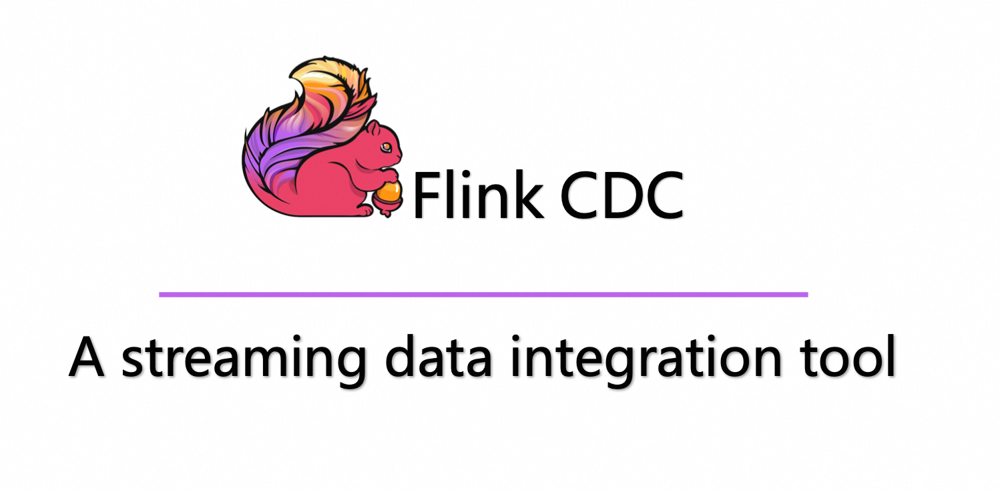
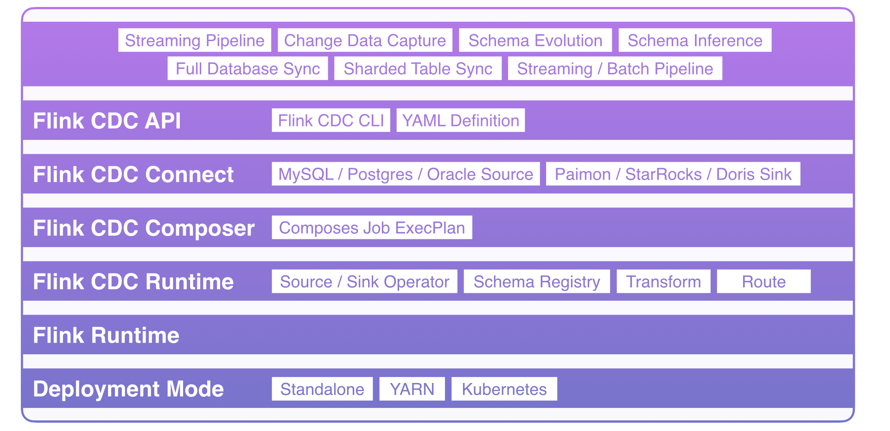

<p align="center">
  <a href="https://nightlies.apache.org/flink/flink-cdc-docs-stable/"></a>
</p>
<p align="center">
<a href="https://github.com/apache/flink-cdc/" target="_blank">
    
</a>
<a href="https://github.com/apache/flink-cdc/releases" target="_blank">
    
</a>
<a href="https://github.com/apache/flink-cdc/actions/workflows/flink_cdc_ci.yml" target="_blank">
    
</a>
<a href="https://github.com/apache/flink-cdc/actions/workflows/flink_cdc_ci_nightly.yml" target="_blank">
    
</a>
<a href="https://github.com/apache/flink-cdc/tree/master/LICENSE" target="_blank">
    
</a>
</p>


Flink CDC is a distributed data integration tool for real time data and batch data. Flink CDC brings the simplicity 
and elegance of data integration via YAML to describe the data movement and transformation in a 
[Data Pipeline](docs/content/docs/core-concept/data-pipeline.md).


The Flink CDC prioritizes efficient end-to-end data integration and offers enhanced functionalities such as 
full database synchronization, sharding table synchronization, schema evolution and data transformation.



### Quickstart Guide

Flink CDC provides a CdcUp CLI utility to start a playground environment and run Flink CDC jobs.
You will need to have a working Docker and Docker compose environment to use it.

1. Run `git clone https://github.com/apache/flink-cdc.git --depth=1` to retrieve a copy of Flink CDC source code.
2. Run `cd tools/cdcup/ && ./cdcup.sh init` to use the CdcUp tool to start a playground environment.
3. Run `./cdcup.sh up` to boot-up docker containers, and wait for them to be ready.
4. Run `./cdcup.sh mysql` to open a MySQL session, and create at least one table.

```sql
-- initialize db and table
CREATE DATABASE cdc_playground;
USE cdc_playground;
CREATE TABLE test_table (id INT PRIMARY KEY, name VARCHAR(32));

-- insert test data
INSERT INTO test_table VALUES (1, 'alice'), (2, 'bob'), (3, 'cicada'), (4, 'derrida');

-- verify if it has been successfully inserted
SELECT * FROM test_table;
```

5. Run `./cdcup.sh pipeline pipeline-definition.yaml` to submit the pipeline job. You may also edit the pipeline definition file for further configurations.
6. Run `./cdcup.sh flink` to access the Flink Web UI.

### Getting Started

1. Prepare a [Apache Flink](https://nightlies.apache.org/flink/flink-docs-master/docs/try-flink/local_installation/#starting-and-stopping-a-local-cluster) cluster and set up `FLINK_HOME` environment variable.
2. [Download](https://github.com/apache/flink-cdc/releases) Flink CDC tar, unzip it and put jars of pipeline connector to Flink `lib` directory.

> If you're using macOS or Linux, you may use `brew install apache-flink-cdc` to install Flink CDC and compatible connectors quickly.

3. Create a **YAML** file to describe the data source and data sink, the following example synchronizes all tables under MySQL app_db database to Doris :
  ```yaml
   source:
     type: mysql
     hostname: localhost
     port: 3306
     username: root
     password: 123456
     tables: app_db.\.*

   sink:
     type: doris
     fenodes: 127.0.0.1:8030
     username: root
     password: ""

   transform:
     - source-table: adb.web_order01
       projection: \*, format('%S', product_name) as product_name
       filter: addone(id) > 10 AND order_id > 100
       description: project fields and filter
     - source-table: adb.web_order02
       projection: \*, format('%S', product_name) as product_name
       filter: addone(id) > 20 AND order_id > 200
       description: project fields and filter

   route:
     - source-table: app_db.orders
       sink-table: ods_db.ods_orders
     - source-table: app_db.shipments
       sink-table: ods_db.ods_shipments
     - source-table: app_db.products
       sink-table: ods_db.ods_products

   pipeline:
     name: Sync MySQL Database to Doris
     parallelism: 2
     user-defined-function:
       - name: addone
         classpath: com.example.functions.AddOneFunctionClass
       - name: format
         classpath: com.example.functions.FormatFunctionClass
  ```
4. Submit pipeline job using `flink-cdc.sh` script.
 ```shell
  bash bin/flink-cdc.sh /path/mysql-to-doris.yaml
 ```
5. View job execution status through Flink WebUI or downstream database.

Try it out yourself with our more detailed [tutorial](docs/content/docs/get-started/quickstart/mysql-to-doris.md). 
You can also see [connector overview](docs/content/docs/connectors/pipeline-connectors/overview.md) to view a comprehensive catalog of the
connectors currently provided and understand more detailed configurations.

### Join the Community

There are many ways to participate in the Apache Flink CDC community. The
[mailing lists](https://flink.apache.org/what-is-flink/community/#mailing-lists) are the primary place where all Flink
committers are present. For user support and questions use the user mailing list. If you've found a problem of Flink CDC,
please create a [Flink jira](https://issues.apache.org/jira/projects/FLINK/summary) and tag it with the `Flink CDC` tag.   
Bugs and feature requests can either be discussed on the dev mailing list or on Jira.


### Contributing

Welcome to contribute to Flink CDC, please see our [Developer Guide](docs/content/docs/developer-guide/contribute-to-flink-cdc.md)
and [APIs Guide](docs/content/docs/developer-guide/understand-flink-cdc-api.md).


### License

[Apache 2.0 License](LICENSE).


### Special Thanks

The Flink CDC community welcomes everyone who is willing to contribute, whether it's through submitting bug reports,
enhancing the documentation, or submitting code contributions for bug fixes, test additions, or new feature development.     
Thanks to all contributors for their enthusiastic contributions.

<a href="https://github.com/apache/flink-cdc/graphs/contributors">
  
</a>
