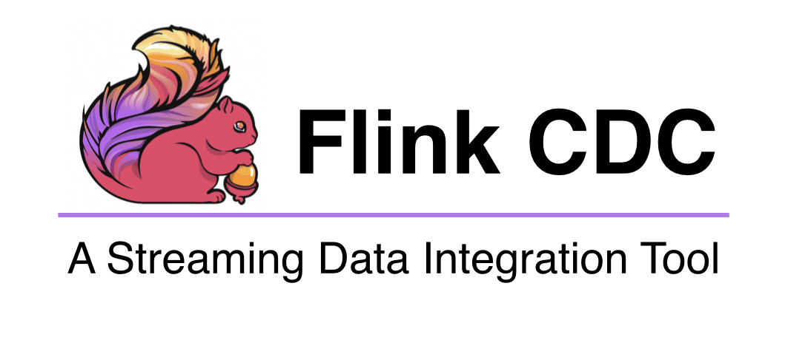
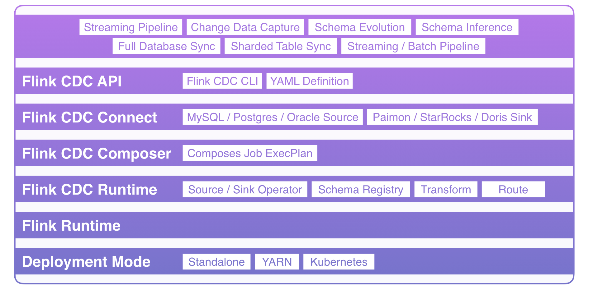

<p align="center">
  <a href="https://nightlies.apache.org/flink/flink-cdc-docs-stable/"></a>
</p>
<p align="center">
<a href="https://github.com/apache/flink-cdc/" target="_blank">
    
</a>
<a href="https://github.com/apache/flink-cdc/releases" target="_blank">
    
</a>
<a href="https://github.com/apache/flink-cdc/actions/workflows/flink_cdc_ci.yml" target="_blank">
    
</a>
<a href="https://github.com/apache/flink-cdc/actions/workflows/flink_cdc_ci_nightly.yml" target="_blank">
    
</a>
<a href="https://github.com/apache/flink-cdc/tree/master/LICENSE" target="_blank">
    
</a>
</p>


Flink CDC is a distributed data integration tool for real-time data and batch data, built on top of Apache Flink. It prioritizes efficient end-to-end data integration and offers enhanced functionalities such as full database synchronization, sharding table synchronization, schema evolution and data transformation.



## API Layers

Flink CDC provides three API layers for different usage scenarios:

### 1. YAML API (Pipeline API)

The YAML API provides a declarative, zero-code approach to define data pipelines. Users describe the source, sink, [routing](https://nightlies.apache.org/flink/flink-cdc-docs-stable/docs/core-concept/route/), [transformation](https://nightlies.apache.org/flink/flink-cdc-docs-stable/docs/core-concept/transform/), and [schema evolution](https://nightlies.apache.org/flink/flink-cdc-docs-stable/docs/core-concept/schema-evolution/) rules in a YAML file and submit it via the `flink-cdc.sh` CLI.

Please refer to the [Quickstart Guide](https://nightlies.apache.org/flink/flink-cdc-docs-stable/docs/get-started/introduction/) for detailed setup instructions.

```yaml
source:
  type: mysql
  hostname: localhost
  port: 3306
  username: root
  password: 123456
  tables: app_db.\.*

sink:
  type: doris
  fenodes: 127.0.0.1:8030
  username: root
  password: ""

# Transform data on-the-fly
transform:
  - source-table: app_db.orders
    projection: id, order_id, UPPER(product_name) as product_name
    filter: id > 10 AND order_id > 100
    
# Route source tables to different sink tables
route:
  - source-table: app_db.orders
    sink-table: ods_db.ods_orders
  - source-table: app_db.shipments
    sink-table: ods_db.ods_shipments
  - source-table: app_db.\.*
    sink-table: ods_db.others

pipeline:
  name: Sync MySQL Database to Doris
  parallelism: 2
  schema.change.behavior: evolve  # Support schema evolution
```

**Pipeline connectors:**

[Doris](https://mvnrepository.com/artifact/org.apache.flink/flink-cdc-pipeline-connector-doris) | [Elasticsearch](https://mvnrepository.com/artifact/org.apache.flink/flink-cdc-pipeline-connector-elasticsearch) | [Fluss](https://mvnrepository.com/artifact/org.apache.flink/flink-cdc-pipeline-connector-fluss) | [Hudi](https://mvnrepository.com/artifact/org.apache.flink/flink-cdc-pipeline-connector-hudi) | [Iceberg](https://mvnrepository.com/artifact/org.apache.flink/flink-cdc-pipeline-connector-iceberg) | [Kafka](https://mvnrepository.com/artifact/org.apache.flink/flink-cdc-pipeline-connector-kafka) | [MaxCompute](https://mvnrepository.com/artifact/org.apache.flink/flink-cdc-pipeline-connector-maxcompute) | [MySQL](https://mvnrepository.com/artifact/org.apache.flink/flink-cdc-pipeline-connector-mysql) | [OceanBase](https://mvnrepository.com/artifact/org.apache.flink/flink-cdc-pipeline-connector-oceanbase) | [Oracle](https://mvnrepository.com/artifact/org.apache.flink/flink-cdc-pipeline-connector-oracle) | [Paimon](https://mvnrepository.com/artifact/org.apache.flink/flink-cdc-pipeline-connector-paimon) | [PostgreSQL](https://mvnrepository.com/artifact/org.apache.flink/flink-cdc-pipeline-connector-postgres) | [StarRocks](https://mvnrepository.com/artifact/org.apache.flink/flink-cdc-pipeline-connector-starrocks)

See the [connector overview](https://nightlies.apache.org/flink/flink-cdc-docs-stable/docs/connectors/pipeline-connectors/overview/) for a full list and configurations.

### 2. SQL API (Table/SQL API)

The SQL API integrates with Flink SQL, allowing users to define CDC sources using SQL DDL statements. Deploy the SQL connector JAR to `FLINK_HOME/lib/` and use it directly in Flink SQL Client:

```sql
CREATE TABLE mysql_binlog (
  id INT NOT NULL,
  name STRING,
  description STRING,
  weight DECIMAL(10,3),
  PRIMARY KEY(id) NOT ENFORCED
) WITH (
  'connector' = 'mysql-cdc',
  'hostname' = 'localhost',
  'port' = '3306',
  'username' = 'flinkuser',
  'password' = 'flinkpw',
  'database-name' = 'inventory',
  'table-name' = 'products'
);

SELECT id, UPPER(name), description, weight FROM mysql_binlog;
```

**Available SQL connectors** (dependencies bundled):

[MySQL](https://mvnrepository.com/artifact/org.apache.flink/flink-sql-connector-mysql-cdc) | [PostgreSQL](https://mvnrepository.com/artifact/org.apache.flink/flink-sql-connector-postgres-cdc) | [Oracle](https://mvnrepository.com/artifact/org.apache.flink/flink-sql-connector-oracle-cdc) | [SQL Server](https://mvnrepository.com/artifact/org.apache.flink/flink-sql-connector-sqlserver-cdc) | [MongoDB](https://mvnrepository.com/artifact/org.apache.flink/flink-sql-connector-mongodb-cdc) | [OceanBase](https://mvnrepository.com/artifact/org.apache.flink/flink-sql-connector-oceanbase-cdc) | [TiDB](https://mvnrepository.com/artifact/org.apache.flink/flink-sql-connector-tidb-cdc) | [Db2](https://mvnrepository.com/artifact/org.apache.flink/flink-sql-connector-db2-cdc) | [Vitess](https://mvnrepository.com/artifact/org.apache.flink/flink-sql-connector-vitess-cdc)

See the [source connector overview](https://nightlies.apache.org/flink/flink-cdc-docs-stable/docs/connectors/flink-sources/overview/) for a full list and configurations.

### 3. DataStream API

The DataStream API provides programmatic access for building custom Flink streaming applications. Add the corresponding connector as a Maven dependency:

```xml
<dependency>
  <groupId>org.apache.flink</groupId>
  <artifactId>flink-connector-mysql-cdc</artifactId>
  <version>${flink-cdc.version}</version>
</dependency>
```

**Available source connectors:**

[MySQL](https://mvnrepository.com/artifact/org.apache.flink/flink-connector-mysql-cdc) | [PostgreSQL](https://mvnrepository.com/artifact/org.apache.flink/flink-connector-postgres-cdc) | [Oracle](https://mvnrepository.com/artifact/org.apache.flink/flink-connector-oracle-cdc) | [SQL Server](https://mvnrepository.com/artifact/org.apache.flink/flink-connector-sqlserver-cdc) | [MongoDB](https://mvnrepository.com/artifact/org.apache.flink/flink-connector-mongodb-cdc) | [OceanBase](https://mvnrepository.com/artifact/org.apache.flink/flink-connector-oceanbase-cdc) | [TiDB](https://mvnrepository.com/artifact/org.apache.flink/flink-connector-tidb-cdc) | [Db2](https://mvnrepository.com/artifact/org.apache.flink/flink-connector-db2-cdc) | [Vitess](https://mvnrepository.com/artifact/org.apache.flink/flink-connector-vitess-cdc)

All artifacts use group ID `org.apache.flink`. See the [DataStream API packaging guide](https://nightlies.apache.org/flink/flink-cdc-docs-stable/docs/connectors/flink-sources/datastream-api-package-guidance/) for a complete `pom.xml` example.

## Flink Version Compatibility

| Flink CDC Version | Flink Version             | Notes                             |
|-------------------|---------------------------|-----------------------------------|
| 3.6.x             | 1.20.\*, 2.2.\*           |                                   |
| 3.5.x             | 1.19.\*, 1.20.\*          |                                   |
| 3.4.x             | 1.19.\*, 1.20.\*          |                                   |
| 3.3.x             | 1.19.\*, 1.20.\*          |                                   |
| 3.2.x             | 1.17.\*, 1.18.\*, 1.19.\* |                                   |
| 3.1.x             | 1.17.\*, 1.18.\*, 1.19.\* | Only 3.1.1 supports Flink 1.19.\* |
| 3.0.x             | 1.17.\*, 1.18.\*          |                                   |

## Join the Community

There are many ways to participate in the Apache Flink CDC community. The
[mailing lists](https://flink.apache.org/what-is-flink/community/#mailing-lists) are the primary place where all Flink
committers are present. For user support and questions use the user mailing list. If you've found a problem of Flink CDC,
please create a [Flink JIRA](https://issues.apache.org/jira/projects/FLINK/summary) and tag it with the `Flink CDC` tag.
Bugs and feature requests can either be discussed on the dev mailing list or on Jira.

## Contributing

Welcome to contribute to Flink CDC, please see our [Developer Guide](https://nightlies.apache.org/flink/flink-cdc-docs-stable/docs/developer-guide/contribute-to-flink-cdc/)
and [APIs Guide](https://nightlies.apache.org/flink/flink-cdc-docs-stable/docs/developer-guide/understand-flink-cdc-api/).

## License

[Apache 2.0 License](LICENSE).

## Special Thanks

The Flink CDC community welcomes everyone who is willing to contribute, whether it's through submitting bug reports,
enhancing the documentation, or submitting code contributions for bug fixes, test additions, or new feature development.     
Thanks to all contributors for their enthusiastic contributions.

<a href="https://github.com/apache/flink-cdc/graphs/contributors">
  
</a>
